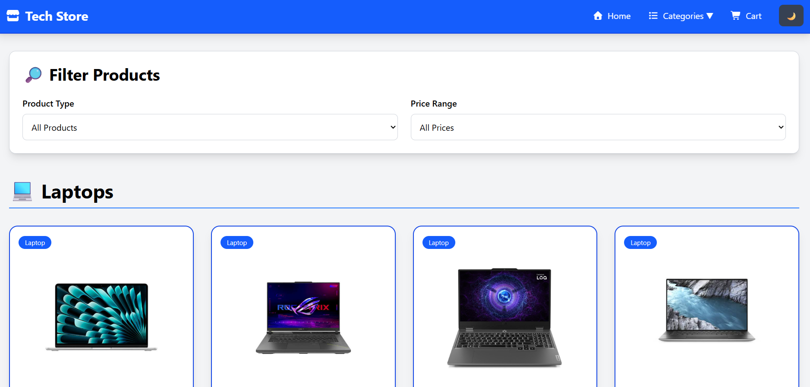
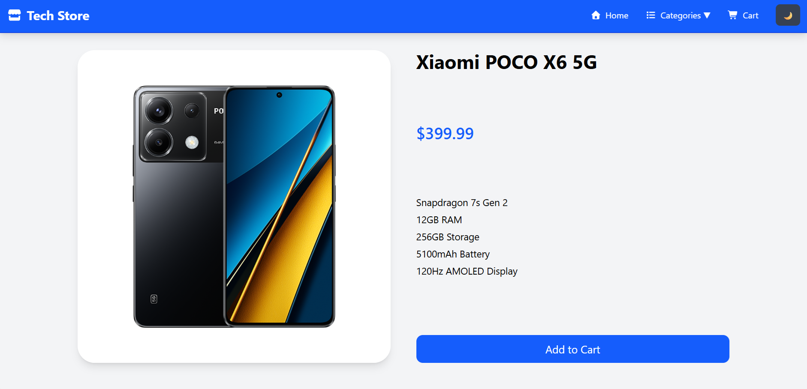
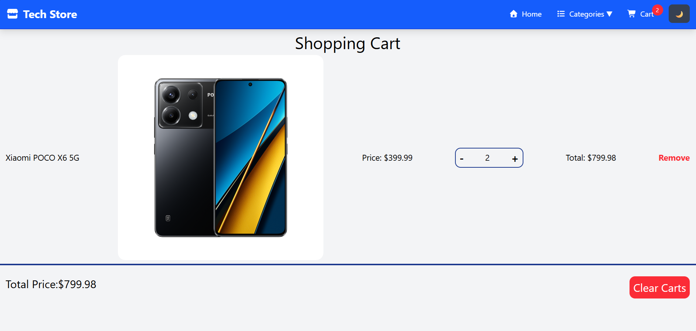
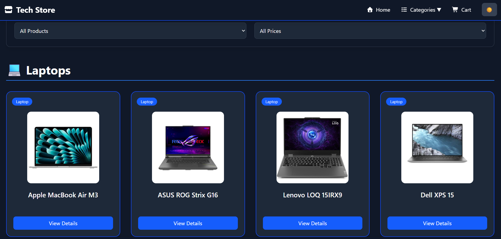

# 🛒 Tech Store

A modern and responsive **E-Commerce Web Application** built with **React**, **TypeScript**, **Vite**, and **Tailwind CSS**.

This project demonstrates modern frontend development practices, reusable component architecture, state management, responsive design, and an intuitive shopping experience.

---

## 🌐 Live Demo

🔗 **Vercel:** https://tech-store-react-typescript-tailwin-ten.vercel.app/

---


## ✨ Features

* 🏠 Modern Home Page
* 🛍️ Product Categories
* 🔍 Product Details Page
* 🛒 Shopping Cart
* 🌙 Dark / Light Mode
* 📱 Fully Responsive Design
* 🔄 Loading Screen
* ⬆️ Scroll To Top Button
* 🎯 Product Filtering
* 🔗 Related Products
* 🧭 Smooth Navigation
* ❌ Custom 404 Page
* ⚡ Fast Performance with Vite

---

## 🛠️ Technologies Used

* React
* TypeScript
* Vite
* React Router DOM
* Tailwind CSS
* Context API
* Font Awesome
* React Icons

---

## 📂 Project Structure

```text
src
│
├── components
│   ├── Navbar
│   ├── Footer
│   ├── ProductCard
│   ├── Loading
│   └── ScrollToTop
│
├── pages
│   ├── Home
│   ├── ProductDetails
│   ├── Cart
│   └── NotFound
│
├── context
│   ├── CartContext
│   └── ThemeContext
│
├── data
│   └── products.ts
│
├── App.tsx
└── main.tsx
```

---

## 🚀 Getting Started

Clone the repository:

```bash
git clone https://github.com/YourUsername/tech-store.git
```

Install dependencies:

```bash
npm install
```

Run the development server:

```bash
npm run dev
```

---

## 📸 Screenshots

### 🏠 Home

<p align="center">
  
</p>

### 📦 Product Details

<p align="center">
  
</p>

### 🛒 Shopping Cart

<p align="center">
  
</p>

### 🌙 Dark Mode

<p align="center">
  
</p>

---

## 🎯 Future Improvements

* User Authentication
* Wishlist
* Product Search
* Product Sorting
* Backend Integration
* Payment Gateway
* Order History
* Admin Dashboard

---

## 👨‍💻 Author

**Mohammad Jm**

GitHub: https://github.com/mohammadjmweb

---

## 📄 License

This project is developed for educational purposes and portfolio presentation.
